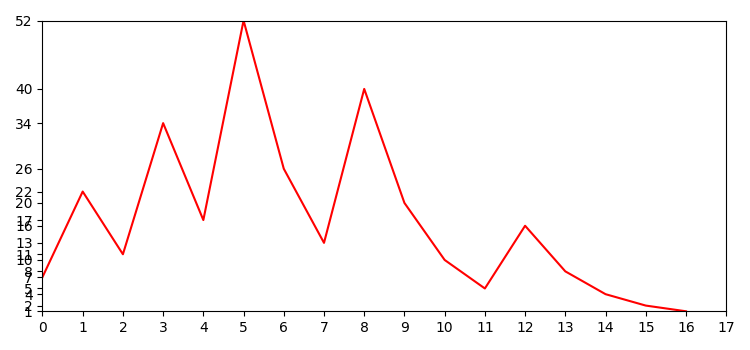

# conjecture
et son principe est comme suivant:
si le nombre est pair on divise par 2
sinon on multiplie par 3 et on ajoute 1

toute nombre donné à cet algorithme va toujours atteindre 1

# exemple
on choisi par exemple le nombre 7
```
7 * 3 + 1 = 22
22/2 = 11
11 * 3 + 1 = 34
34/1 = 17
17 * 3 + 1 = 52
52/2 = 26 
26/2 = 13
13 * 3 + 1 = 40
40/2 = 20
20/2 = 10
10/2 = 5
5 * 3 + 1 = 16
16/2 = 8
8/2 = 4
4/2 = 2
2/2 = 1
```

</img>

# la question est:
<center><h5>est-ce qu'il y a un nombre qui ne donnera jamais 1?</h5></center>
